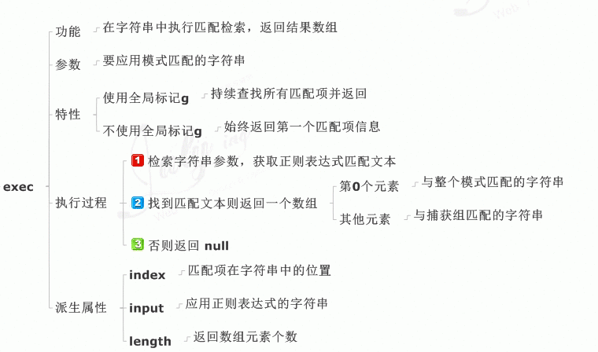

## 创建regex

### 方式

- 字面量：`var 变量名 = /表达式/模式修饰符`
- 函数：`var 变量名 = new RegExp("表达式",“模式修饰符”)`

### 说明

#### 单个字符和数字

#### 空白字符

#### 定位符

#### 限定符-分组-引用-或模式

#### 模式修饰符

## regex属性

### 实例属性

### 构造函数属性

## regex方法

### 实例方法

#### exec

#### test

### 字符串方法

